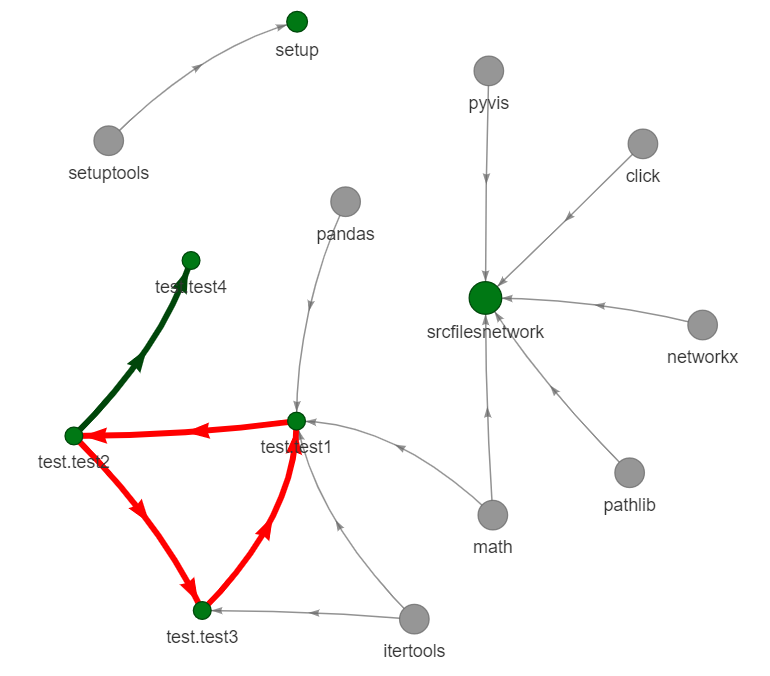

# Srcfilesnetwork

A Script to visualize how python modules in a project/folder import each other and external packages.

The script automatically ingores folders specified in a  `.gitignore` file.

## Requirements

```shell
networkx==2.5
pyvis==0.1.9
click
```

## Using the script in a virtual environment

After cloning the repository, to plot the import network for the current repository (the `test` folder contains an example of a cyclical import):

```shell
python3 -m venv .venv
source .venv/bin/activate
pip install .
```

Then you can either execute the newly installed `srcfilesnetwork` python module or directly call the `scrfilesnetwork.py` script

```shell
python srcfilesnetwork.py .
python -m scrfilenetwork . 
```

It will produce an html file visualizing the import structure of this project as follows



Files in the folder are highlighted in green, with imports between them highligted in bold green. The size of the nodes is proportional to the length of the python file.

Packages imported by these files are in gray.

Cyclical imports are highlighted in red.

## Syntax

```shell
srcfilesnetwork.py [OPTIONS] PATH

Options: 
--saveas TEXT  html file where to save the network plot.  [default:_scrnetwork.html]
--help         Show this message and exit.
```
